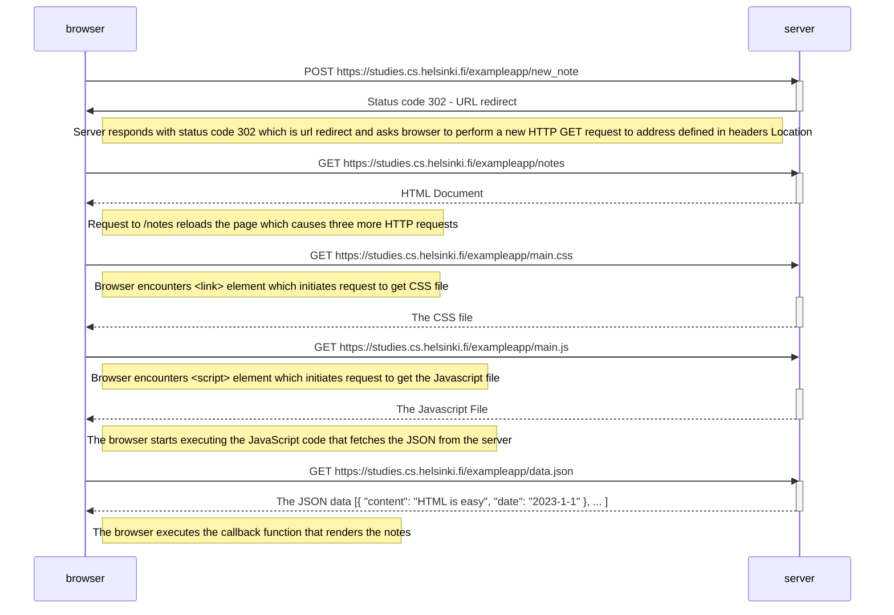

# Part 0: Fundamentals of how web application works Exercise submissions

## Exercise 0.4: New Note Diagram - Solution

```mermaid
sequenceDiagram
    participant browser
    participant server

    browser->>server: POST https://studies.cs.helsinki.fi/exampleapp/new_note
    activate server
    server->>browser: Status code 302 - URL redirect
    deactivate server

    Note left of server: Server responds with status code 302 which is url redirect and asks browser to perform a new HTTP GET request to address defined in headers Location

    browser->>server: GET https://studies.cs.helsinki.fi/exampleapp/notes
    activate server
    server-->>browser: HTML Document
    deactivate server

    Note right of browser: Request to /notes reloads the page which causes three more HTTP requests

    browser->>server: GET https://studies.cs.helsinki.fi/exampleapp/main.css
    Note right of browser: Browser encounters <link> element which initiates request to get CSS file
    activate server
    server-->>browser: The CSS file
    deactivate server

    browser->>server: GET https://studies.cs.helsinki.fi/exampleapp/main.js
    Note right of browser: Browser encounters <script> element which initiates request to get the Javascript file
    activate server
    server-->>browser: The Javascript File
    deactivate server

    Note right of browser: The browser starts executing the JavaScript code that fetches the JSON from the server

    browser->>server: GET https://studies.cs.helsinki.fi/exampleapp/data.json
    activate server
    server-->>browser: The JSON data [{ "content": "HTML is easy", "date": "2023-1-1" }, ... ]
    deactivate server

    Note right of browser: The browser executes the callback function that renders the notes
```

